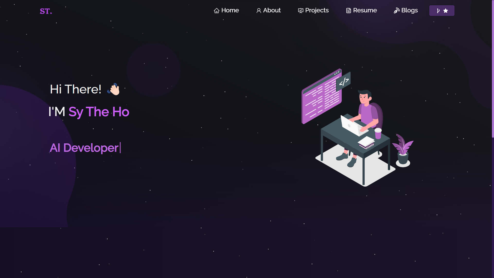

<h2 align="center">
  Portfolio Website 
  <a href="https://hsthe29.github.io/" target="_blank">hsthe29</a>
</h2>

  

 

Templated by [Soumyajit4419](https://github.com/soumyajit4419/Portfolio). Thanks!

## Built With

My personal portfolio <a href="https://hsthe29.github.io/" target="_blank">hsthe29</a> which features some of my github projects as well as my resume and technical skills. 

This project was built using these technologies.

- React.js
- Node.js
- Express.js
- CSS3
- VsCode
- Github Pages

# Give a ⭐ if you like this website!